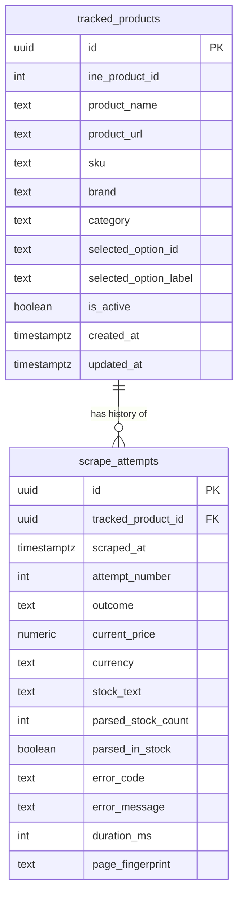

# StoreWatch v2 — Data Model Specification

## 1. Overview & Architectural Rationale

The StoreWatch v2 database schema is built directly on the empirical findings from Phase 1 storefront reverse engineering. It follows an intentionally simple, explainable **two-table design**:



### Key Architectural Principles

1. **Option-Level Tracking (`tracked_products`)**:
   Phase 1 proved that prices and stock in the INE storefront are variant-specific (e.g. `2-pack` vs `3-pack`, `Standard kit` vs `Creator kit`), keyed by the `option` query parameter (`?opt=o2`). Consequently, each tracked entity represents a single **product + chosen option** pair.
2. **One Immutable Table for All Scrape Telemetry (`scrape_attempts`)**:
   Instead of fragmenting price history, error logs, and scrape metadata across multiple tables, a single immutable, append-only log powers:
   - **Price & Stock History**: `SELECT ... WHERE outcome = 'success' ORDER BY scraped_at DESC`
   - **Per-Product Scrape Log**: `SELECT ... WHERE tracked_product_id = :id ORDER BY scraped_at DESC`
   - **CSV Export**: `SELECT ... ORDER BY scraped_at DESC`
3. **Database-Enforced Data Quality**:
   Check constraints strictly enforce that successful scrapes have complete, verified price and stock data, while retried or failed attempts never pollute price statistics with nulls or partial values.
4. **Deliberate Exclusion of Ephemeral Marketing Attributes**:
   - Decoy DOM elements (`span.price-value`, `span.amount`) are explicitly discarded.
   - MRP, savings percentage, seller name, delivery estimate text, and star ratings are intentionally omitted from core tracking data to keep the schema clean, resilient, and performant.

---

## 2. Table Specifications

### A. `tracked_products`
Defines **what** StoreWatch monitors.

| Column | Type | Nullable | Default | Description |
|---|---|---|---|---|
| `id` | `UUID` | No | `gen_random_uuid()` | Internal primary key. |
| `ine_product_id` | `INTEGER` | No | — | Storefront numeric ID from URL (`/item/:id`, e.g. `2456`). |
| `product_name` | `TEXT` | No | — | Canonical product name from catalogue or detail API. |
| `product_url` | `TEXT` | No | — | Full target URL (e.g. `https://demo.inelabteamdev.com/item/2456`). |
| `sku` | `TEXT` | Yes | `NULL` | Product SKU (e.g. `SK-2456-JU`). |
| `brand` | `TEXT` | Yes | `NULL` | Brand name (e.g. `Junova`). |
| `category` | `TEXT` | Yes | `NULL` | Product category (e.g. `Lighting`). |
| `selected_option_id` | `TEXT` | No | — | The option ID monitored (e.g. `o1`, `o2`, `o3`). |
| `selected_option_label` | `TEXT` | No | — | The human-readable option label (e.g. `Neutral white`, `2-pack`). |
| `is_active` | `BOOLEAN` | No | `true` | Controls whether the scraper worker polls this item. |
| `created_at` | `TIMESTAMPTZ` | No | `now()` | UTC creation timestamp. |
| `updated_at` | `TIMESTAMPTZ` | No | `now()` | UTC last-modified timestamp (maintained via trigger). |

**Constraints:**
- `PRIMARY KEY (id)`
- `UNIQUE (ine_product_id, selected_option_id)`: Prevents duplicate tracking of the same variant.

---

### B. `scrape_attempts`
One immutable row per actual scrape attempt executed by the worker.

| Column | Type | Nullable | Default | Description |
|---|---|---|---|---|
| `id` | `UUID` | No | `gen_random_uuid()` | Internal primary key. |
| `tracked_product_id` | `UUID` | No | — | Foreign key to `tracked_products.id` (`ON DELETE CASCADE`). |
| `scraped_at` | `TIMESTAMPTZ` | No | `now()` | UTC timestamp when this attempt ran. |
| `attempt_number` | `INTEGER` | No | `1` | Index within a multi-attempt execution (1, 2, 3...). |
| `outcome` | `TEXT` | No | — | Lifecycle outcome: `'success'`, `'retried'`, or `'failed'`. |
| `current_price` | `NUMERIC(12, 2)`| Yes | `NULL` | Verified selling price (e.g. `20969.00`). |
| `currency` | `TEXT` | Yes | `NULL` | Currency identifier (e.g. `'INR'`). |
| `stock_text` | `TEXT` | Yes | `NULL` | Raw verified stock text (e.g. `'Stock: 73 remaining'`, `'Sold out'`). |
| `parsed_stock_count` | `INTEGER` | Yes | `NULL` | Parsed numeric inventory (e.g. `73`, or `0` for sold out). |
| `parsed_in_stock` | `BOOLEAN` | Yes | `NULL` | Flag indicating if product is purchasable. |
| `error_code` | `TEXT` | Yes | `NULL` | Machine-readable error code (`RATE_LIMITED_429`, `TIMEOUT`, etc.). |
| `error_message` | `TEXT` | Yes | `NULL` | Human-readable diagnostics or error explanation. |
| `duration_ms` | `INTEGER` | No | — | Total elapsed duration of this attempt in milliseconds. |
| `page_fingerprint` | `TEXT` | Yes | `NULL` | Optional UI manifest revision (e.g. `rev-633002-v1`). |

---

## 3. Strict Database-Level Integrity Rules

The schema enforces a composite conditional check constraint (`chk_scrape_outcome_integrity`):

```sql
CONSTRAINT chk_scrape_outcome_integrity CHECK (
  (
    outcome = 'success'
    AND current_price IS NOT NULL
    AND currency IS NOT NULL
    AND stock_text IS NOT NULL
    AND parsed_in_stock IS NOT NULL
    AND error_code IS NULL
    AND error_message IS NULL
  )
  OR
  (
    outcome IN ('retried', 'failed')
    AND current_price IS NULL
    AND currency IS NULL
    AND stock_text IS NULL
    AND parsed_stock_count IS NULL
    AND parsed_in_stock IS NULL
  )
)
```

### Why this rule is essential:
1. **No Corrupt Price Points**: It is mathematically impossible for a failed scrape or an incomplete retry to insert a `$0.00` or `NULL` price point that breaks moving-average or price-drop alert calculations.
2. **No False Successes**: A row cannot claim `outcome = 'success'` unless all four critical commercial metrics (`current_price`, `currency`, `stock_text`, and `parsed_in_stock`) are present.
3. **Clean Audit Log**: Retry and failure rows record only diagnostic telemetry (`error_code`, `error_message`, `duration_ms`), keeping error analysis completely separated from commercial price metrics.

---

## 4. Exclusion of Decoys and Secondary Attributes

Phase 1 reverse engineering proved that the storefront serves decoys and volatile marketing copy:
1. **Decoys**: Naive scrapers extract `<span class="price-value" style="display:none">₹23,293</span>` or `<span class="amount" data-price="true" style="display:none">₹26,078</span>`. These fake prices are discarded before database insertion.
2. **MRP / Was Price**: Often static or fictional marketing figures; tracking true selling price is the core requirement.
3. **Savings Percentage**: Computed client-side; storing it introduces redundant data that can easily be derived when needed.
4. **Seller & Delivery Estimates**: Frequently rotate between fulfillment hubs and regional warehouses without affecting the product's selling price or core stock status.
5. **Star Ratings**: Re-aggregated on different cadences; not part of core price/stock monitoring.

By storing only the verified current price and stock status, database footprint remains minimal, write throughput remains high, and historical indexing remains lean.

---

## 5. Practical Query Patterns

### Query 1: Active Products Polling List (for Worker / Scheduler)
```sql
SELECT 
  id,
  ine_product_id,
  product_url,
  selected_option_id,
  selected_option_label
FROM tracked_products
WHERE is_active = true;
```

### Query 2: Product Price & Stock History View (for Charting)
```sql
SELECT 
  scraped_at,
  current_price,
  currency,
  stock_text,
  parsed_stock_count,
  parsed_in_stock
FROM scrape_attempts
WHERE tracked_product_id = 'c1b48b94-845b-4c28-98e3-05b63e8a4a51'
  AND outcome = 'success'
ORDER BY scraped_at ASC;
```

### Query 3: Per-Product Operational Scrape Log
```sql
SELECT 
  scraped_at,
  attempt_number,
  outcome,
  duration_ms,
  current_price,
  error_code,
  error_message
FROM scrape_attempts
WHERE tracked_product_id = 'c1b48b94-845b-4c28-98e3-05b63e8a4a51'
ORDER BY scraped_at DESC
LIMIT 50;
```

### Query 4: Full CSV Export Query
```sql
SELECT 
  tp.ine_product_id,
  tp.product_name,
  tp.sku,
  tp.brand,
  tp.category,
  tp.selected_option_id,
  tp.selected_option_label,
  sa.scraped_at,
  sa.attempt_number,
  sa.outcome,
  sa.current_price,
  sa.currency,
  sa.stock_text,
  sa.parsed_stock_count,
  sa.parsed_in_stock,
  sa.duration_ms,
  sa.error_code,
  sa.error_message
FROM scrape_attempts sa
JOIN tracked_products tp ON sa.tracked_product_id = tp.id
ORDER BY sa.scraped_at DESC;
```

### Query 5: Dashboard Overview (Using `v_latest_product_prices` View)
```sql
SELECT 
  product_name,
  selected_option_label,
  current_price,
  currency,
  stock_text,
  parsed_in_stock,
  last_scraped_at
FROM v_latest_product_prices
WHERE is_active = true
ORDER BY product_name ASC;
```
